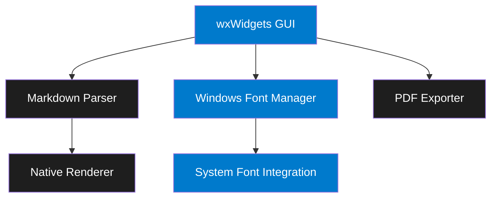

<div align="center">


# Markdown Viewer (MDV)

🚀 A blazingly fast, Notepad-like Markdown viewer for Windows

[](https://opensource.org/licenses/MIT)
[](https://github.com/mikl0s/MDV)
[](https://en.wikipedia.org/wiki/C%2B%2B17)
[](https://www.wxwidgets.org/)
[](https://github.com/mikl0s/MDV/pulls)

[Features](#features) • [Installation](#installation) • [Usage](#usage) • [Themes](#themes) • [Contributing](#contributing)


</div>

## ✨ Features

- 🎯 **Fast as Notepad** - Instant startup, minimal memory usage
- 🎨 **Windows-native Themes** - Follows your system theme
- 🔤 **Native Font Integration** - One-click FiraMono installation, use any Windows font
- 📑 **GitHub Flavored Markdown** - Tables, code blocks, and more
- 🖨️ **PDF Export** - Generate beautiful PDFs with a click
- 💡 **Ultra Lightweight** - Smaller than a typical web browser
- 🪟 **Windows Integration** - Native menus, dialogs, and system fonts

## 🚀 Quick Start

```powershell
# Download the latest release
winget install MDV
```

## 🎨 Themes

MDV follows your Windows theme settings:

<div align="center">
<table>
<tr>
<td align="center">
<strong>Dark Theme (Windows Dark)</strong><br>

</td>
<td align="center">
<strong>Light Theme (Windows Light)</strong><br>

</td>
</tr>
</table>
</div>

## 🏗️ Architecture



## 🛠️ Building from Source

### Prerequisites

1. Install MSYS2 from https://www.msys2.org/
2. Open MSYS2 and install required packages:
```bash
pacman -S mingw-w64-x86_64-gcc mingw-w64-x86_64-cmake mingw-w64-x86_64-wxWidgets make
```
3. Add MinGW-w64 bin directory to your PATH:
```
C:\msys64\mingw64\bin
```

### Build Steps

1. Clone the repository
```bash
git clone https://github.com/mikl0s/MDV.git
cd MDV
```

2. Configure and build
```bash
# Configure
cmake -B build -G "MinGW Makefiles"

# Build
cmake --build build --config Release
```

The executable will be in `build/bin/mdv.exe`

## 📖 Usage

1. Launch MDV
2. Open a Markdown file via File → Open or drag & drop
3. Use the menu to:
   - Switch themes (follows Windows theme)
   - Install FiraMono Nerd Font (Settings → Install FiraMono)
   - Select system fonts (Settings → Font)
   - Export to PDF (File → Export to PDF)

## 🤝 Contributing

Contributions are welcome! Please feel free to submit a Pull Request. For major changes, please open an issue first to discuss what you would like to change.

## 📄 License

This project is licensed under the MIT License - see below for details:

```
MIT License

Copyright (c) 2025 Mikkel Georgsen / Dataløs

Permission is hereby granted, free of charge, to any person obtaining a copy
of this software and associated documentation files (the "Software"), to deal
in the Software without restriction, including without limitation the rights
to use, copy, modify, merge, publish, distribute, sublicense, and/or sell
copies of the Software, and to permit persons to whom the Software is
furnished to do so, subject to the following conditions:

The above copyright notice and this permission notice shall be included in all
copies or substantial portions of the Software.

THE SOFTWARE IS PROVIDED "AS IS", WITHOUT WARRANTY OF ANY KIND, EXPRESS OR
IMPLIED, INCLUDING BUT NOT LIMITED TO THE WARRANTIES OF MERCHANTABILITY,
FITNESS FOR A PARTICULAR PURPOSE AND NONINFRINGEMENT. IN NO EVENT SHALL THE
AUTHORS OR COPYRIGHT HOLDERS BE LIABLE FOR ANY CLAIM, DAMAGES OR OTHER
LIABILITY, WHETHER IN AN ACTION OF CONTRACT, TORT OR OTHERWISE, ARISING FROM,
OUT OF OR IN CONNECTION WITH THE SOFTWARE OR THE USE OR OTHER DEALINGS IN THE
SOFTWARE.
```

---

<div align="center">
Made with ❤️ by <a href="https://github.com/mikl0s">Mikkel Georgsen</a>
</div>