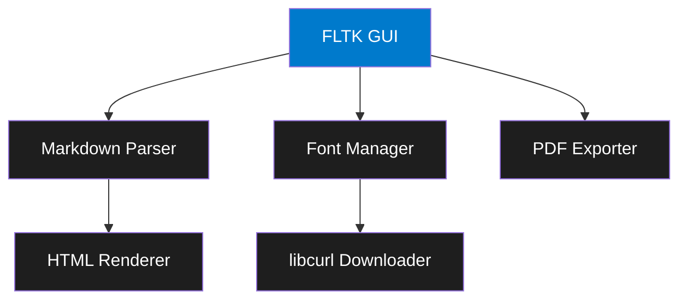

<div align="center">


# Markdown Viewer (MDV)

🚀 A blazingly fast, lightweight Markdown viewer built with FLTK and modern C++

[](https://opensource.org/licenses/MIT)
[](https://github.com/mikl0s/MDV)
[](https://en.wikipedia.org/wiki/C%2B%2B17)
[](https://www.fltk.org/)
[](https://github.com/mikl0s/MDV/pulls)

[Features](#features) • [Installation](#installation) • [Usage](#usage) • [Themes](#themes) • [Contributing](#contributing)


</div>

## ✨ Features

- 🎯 **Minimalistic & Fast** - Starts up as quick as Notepad
- 🎨 **Dark & Light Themes** - Easy on your eyes, day or night
- 🔤 **Custom Fonts** - Bundled with FiraMono, download more from Nerd Fonts
- 📑 **GitHub Flavored Markdown** - Full GFM support including tables and code blocks
- 🖨️ **PDF Export** - Generate beautiful PDFs with a single click
- 🚀 **Cross-Platform** - Runs natively on Windows and Linux
- 💡 **Memory Efficient** - Minimal resource usage

## 🚀 Quick Start

### Windows
```powershell
# Download the latest release
winget install MDV

# Or build from source
cmake -B build -S .
cmake --build build --config Release
```

### Linux
```bash
# Ubuntu/Debian
sudo apt install mdv

# Build from source
mkdir build && cd build
cmake ..
make -j$(nproc)
```

## 🎨 Themes

MDV comes with two carefully crafted themes:

<div align="center">
<table>
<tr>
<td align="center">
<strong>Dark Theme (Default)</strong><br>

</td>
<td align="center">
<strong>Light Theme</strong><br>

</td>
</tr>
</table>
</div>

## 🏗️ Architecture



## 🛠️ Building from Source

### Prerequisites

- CMake 3.15+
- C++17 compatible compiler
- FLTK 1.3.8+
- libcurl
- cmark-gfm or md4c

### Build Steps

1. Clone the repository
```bash
git clone git@github.com:mikl0s/MDV.git
cd MDV
```

2. Create build directory
```bash
mkdir build && cd build
```

3. Configure and build
```bash
cmake ..
make -j$(nproc)  # Linux
# or
cmake --build . --config Release  # Windows
```

## 📖 Usage

1. Launch MDV
2. Open a Markdown file via File → Open or drag & drop
3. Use the menu to:
   - Switch themes (Settings → Theme)
   - Change fonts (Settings → Font)
   - Export to PDF (File → Export to PDF)

## 🤝 Contributing

Contributions are welcome! Please feel free to submit a Pull Request. For major changes, please open an issue first to discuss what you would like to change.

## 📄 License

This project is licensed under the MIT License - see below for details:

```
MIT License

Copyright (c) 2025 Mikkel Georgsen / Dataløs

Permission is hereby granted, free of charge, to any person obtaining a copy
of this software and associated documentation files (the "Software"), to deal
in the Software without restriction, including without limitation the rights
to use, copy, modify, merge, publish, distribute, sublicense, and/or sell
copies of the Software, and to permit persons to whom the Software is
furnished to do so, subject to the following conditions:

The above copyright notice and this permission notice shall be included in all
copies or substantial portions of the Software.

THE SOFTWARE IS PROVIDED "AS IS", WITHOUT WARRANTY OF ANY KIND, EXPRESS OR
IMPLIED, INCLUDING BUT NOT LIMITED TO THE WARRANTIES OF MERCHANTABILITY,
FITNESS FOR A PARTICULAR PURPOSE AND NONINFRINGEMENT. IN NO EVENT SHALL THE
AUTHORS OR COPYRIGHT HOLDERS BE LIABLE FOR ANY CLAIM, DAMAGES OR OTHER
LIABILITY, WHETHER IN AN ACTION OF CONTRACT, TORT OR OTHERWISE, ARISING FROM,
OUT OF OR IN CONNECTION WITH THE SOFTWARE OR THE USE OR OTHER DEALINGS IN THE
SOFTWARE.
```

---

<div align="center">
Made with ❤️ by <a href="https://github.com/mikl0s">Mikkel Georgsen</a>
</div>